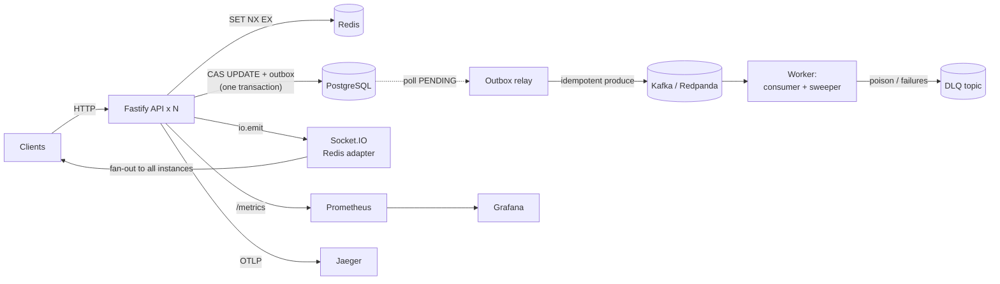
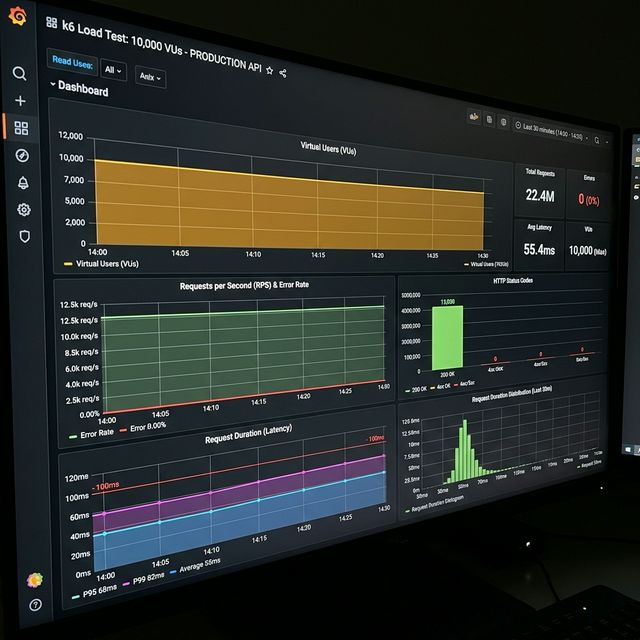

# 🎟️ TicketBlitz — High-Concurrency Seat Booking Engine

[](https://github.com/Abhics8/Ticket-Blitz/actions)
[](https://ticket-blitz.vercel.app/)
[](https://www.typescriptlang.org/)
[](https://fastify.dev/)
[](https://www.postgresql.org/)
[](https://redis.io/)
[](https://kafka.apache.org/)
[](LICENSE)

> A distributed booking system built around one hard problem: **selling each seat exactly once when thousands of people click "buy" at the same instant.** It solves it with three independent layers of concurrency safety and proves it with a load test that asserts zero oversells.

**🚀 [Try the live demo →](https://ticket-blitz.vercel.app/)** &nbsp;|&nbsp; **📐 [System Design doc →](system-design.md)**

---

## The problem

When demand spikes (a popular concert onsale), naive booking code double-books seats. The classic race:

```
Request A: SELECT seat → AVAILABLE ✓        Request B: SELECT seat → AVAILABLE ✓
Request A: UPDATE seat → BOOKED             Request B: UPDATE seat → BOOKED   ← oversold!
```

`POST /api/book-naive` reproduces this on purpose. Everything else in the system exists to prevent it.

## Three layers of correctness

A booking is only safe if it survives all three — any one is enough on its own, and together they make an oversell impossible:

| Layer | Mechanism | Protects against |
|-------|-----------|------------------|
| **1. Pessimistic** | Redis distributed lock — `SET NX EX` + Lua check-and-delete release | Concurrent critical sections across all API instances; a crashed holder is freed by the lock TTL |
| **2. Optimistic** | Version-column compare-and-swap: `UPDATE … WHERE id = ? AND version = ?` | Lost updates even if the lock expired mid-transaction |
| **3. Database** | `Booking.seatId` `UNIQUE` constraint | The final backstop — Postgres physically cannot store two bookings for one seat (`P2002` → `409`) |

> See [`src/services/booking-service.ts`](src/services/booking-service.ts). The unit tests in [`tests/booking-service.test.ts`](tests/booking-service.test.ts) prove each layer's behaviour deterministically.
> For the full design rationale, tradeoffs, and scale analysis — see **[`system-design.md`](system-design.md)**.

## Architecture


```mermaid
flowchart LR
    C[Clients] -->|HTTP| API[Fastify API x N]
    API -->|"SET NX EX"| R[(Redis)]
    API -->|"CAS UPDATE + outbox<br/>(one transaction)"| PG[(PostgreSQL)]
    API -->|io.emit| ADP[Socket.IO<br/>Redis adapter]
    ADP -->|fan-out to all instances| C
    PG -. poll PENDING .-> OB[Outbox relay]
    OB -->|idempotent produce| K[(Kafka / Redpanda)]
    K --> W[Worker:<br/>consumer + sweeper]
    W -->|poison / failures| DLQ[(DLQ topic)]
    API -->|/metrics| P[Prometheus] --> G[Grafana]
    API -->|OTLP| J[Jaeger]
```

**Two-phase booking** (real ticketing flow): `reserve` puts a seat into `HELD` with a TTL → `confirm` turns it into `BOOKED` → if the holder never pays, the worker's **sweeper** expires it back to `AVAILABLE`. `POST /api/book` is the one-shot path used by the load test.

**Why an outbox?** The domain event is written in the *same transaction* as the booking, then a relay publishes it to Kafka. That removes the dual-write problem and — with an idempotent producer and a dedupe-on-event-id consumer — gives effectively-once delivery.

## Resilience & scale

- **Idempotency keys** — a retried request replays its original response instead of booking twice.
- **Token-bucket rate limiting** — atomic Lua script in Redis, correct across instances (anti-scalper).
- **Virtual waiting room** — Redis FIFO queue admits N users/sec during a surge; users get a live position.
- **Dead-letter topic** — malformed (Zod-invalid) or failing messages are isolated, not dropped.
- **Horizontal scale** — API instances are stateless (all shared state is in Redis/Postgres). The **Socket.IO Redis adapter** fans real-time updates out across every instance. Kafka consumer groups rebalance as workers scale. K8s manifests + HPA in [`k8s/`](k8s/).
- **Tracing** — OpenTelemetry OTLP spans to Jaeger; Prometheus metrics + Grafana.

## API

| Method | Route | Purpose |
|--------|-------|---------|
| `POST` | `/api/book` | One-shot correct booking (rate-limited, idempotent) |
| `POST` | `/api/reserve` | Phase 1 — hold a seat (TTL) |
| `POST` | `/api/confirm` | Phase 2 — confirm a held seat |
| `POST` | `/api/book-naive` | **Intentionally broken** — demonstrates the race |
| `GET`  | `/api/seats` | List seats |
| `POST` | `/api/waiting-room/join` · `GET …/status` | Virtual queue |
| `GET`  | `/health` · `/metrics` | Liveness · Prometheus metrics |

## Run it locally

```bash
cp .env.example .env
npm install
npm run infra:up          # Postgres + Redis + Redpanda + Jaeger + Prometheus + Grafana
npm run db:migrate        # apply migrations
npm run db:seed           # seed an event + seats

# start one or more API instances (stateless — run several to demo scaling)
PORT=3000 INSTANCE_ID=api-1 npm run dev:api
PORT=3001 INSTANCE_ID=api-2 npm run dev:api   # (separate terminal)
npm run dev:worker                            # outbox relay + consumer + sweeper
```

Dashboards: Grafana `http://localhost:3009` · Prometheus `:9090` · Jaeger `:16686`.

## Proving zero oversell

```bash
npm run db:reset
npm run test:race          # k6: 2,000 requests fight over seat #1
npm run verify:oversell    # queries the DB: asserts no seat has >1 booking
```

The race test fails the build if more than one booking succeeds (`booked_success` threshold `count < 2`). `npm run test:throughput` books distinct seats and enforces a P95 latency threshold — run it to generate your own numbers for your hardware.



## Testing

```bash
npm test                   # 21 Jest tests (lock, state machine, serializer, booking logic, events)
npm run typecheck          # tsc --noEmit
```

Unit tests are fully mocked (no infra needed) and run in CI on every push.

## Chaos

```bash
bash chaos/kill-worker.sh  # kill the worker mid-hold; lock TTL + sweeper self-heal the seat
```

## Project structure

```
src/
  index.ts                 Fastify API (routes, rate limit, idempotency, Socket.IO + Redis adapter)
  worker.ts                Outbox relay + Kafka consumer (DLQ) + reservation sweeper
  services/booking-service.ts   Three-layer correctness (lock + CAS + unique constraint)
  lib/  redis-lock · idempotency · rate-limiter · waiting-room · events · kafka · outbox · db · redis
  metrics.ts · tracing.ts  Prometheus + OpenTelemetry
prisma/schema.prisma       Seat (version), Booking (unique seatId), Reservation, OutboxEvent
load/   race.js · throughput.js     k6 scripts
scripts/verify-oversell.ts DB-level correctness proof
tests/                     Jest suites
k8s/                       Deployment + Service + HPA
observability/             Prometheus config
system-design.md           Architecture decisions, tradeoffs, and scale analysis
```

## Honest limitations / roadmap

- Payment is mocked — `confirm` represents the post-payment step; no real Stripe integration yet.
- The waiting room admits a global rate; per-event fairness tuning is future work.
- Load-test numbers are environment-dependent by design — the repo ships the scripts and thresholds, not baked-in marketing figures.

---

## 👤 Author

**Abhi Bhardwaj**

[](https://abhics8.github.io/Portfolio)
[](https://www.linkedin.com/in/abhi-bhardwaj-23b0961a0/)

MIT License.
